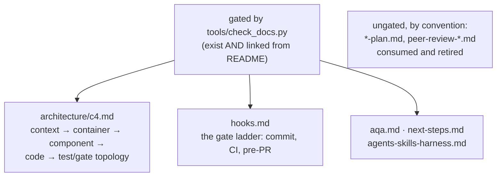

# Working in `docs/`

The record. Everything here is a claim about a repository that can be run, so
the standard is reproducibility, not persuasion: a number in this directory
should be one a reader can regenerate with a named command.

- **A claim with no command behind it is the drift this project exists to
  catch** in other people's repositories. Prefer "`make pre-pr` exit 0, 41
  specs 0/0/0" to "all gates pass".
- **`architecture/c4.md` is gated on rule counts and per-family ranges.**
  `tests/test_rule_registry_docs.py` fails when they drift, so let it tell you
  what to update rather than guessing.
- **`hooks.md`'s CI table must list every job** in `.github/workflows/`;
  `test_hooks_ci_table_lists_every_ci_job` enforces it. Adding a job without
  its row fails the suite.
- **Some files here are generated.** Anything with exactly one writer under
  `tools/` is regenerated by `make skill-artifacts`, never hand-edited.

A `*-plan.md` is deliberately ungated: it is written to be executed and then
retired, so it is linked from a topical doc rather than added to
`REQUIRED_DOCS`. Say in the plan what would make it wrong.

Precedence: where this disagrees with the operating contract in
[`SKILL.md`](../skills/planlint-spec-governance/SKILL.md), `SKILL.md` wins;
then [`../AGENTS.md`](../AGENTS.md); then this file. Nothing here is the only
place a rule is written.
