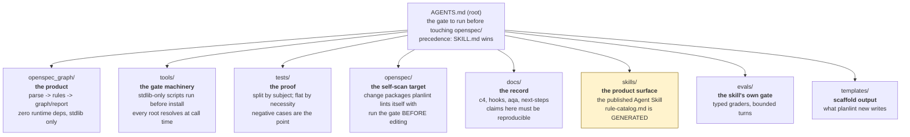

# Plan: per-directory `AGENTS.md`, wired to subagents and gated

**Status:** proposed, not implemented. Sequenced in §6.
**Scope:** eight source directories plus the root. No package behaviour changes.

## 1. What this proposes, and the one reason it is not obviously good

Add an `AGENTS.md` to each working directory, so an agent editing
`tools/check_secrets.py` reads guidance about `tools/` rather than the root
pointer plus a 2321-line guess. Each carries a Mermaid diagram of what the
folder is *for*, and names the subagents and skills that apply to work in it.

The reason to hesitate: **this repository's own thesis is that an unverified
claim is drift waiting to happen**, and nine new prose files are nine new
places for a claim to rot. `README.md` already pays for a linking gate;
`AGENTS.md` shipped wired into nothing and needed
`test_every_root_markdown_file_is_wired_into_the_docs_gate` written after the
fact to catch that class.

So the plan is sequenced gates-first (§6). If only half of it ships, the half
that ships should be the enforcement, not the prose.

## 2. The convention being followed

`AGENTS.md` is an open, cross-tool convention: plain Markdown, no schema, read
by the agent working in the tree. Its two load-bearing properties:

- **Nearest-file-wins.** An agent editing a file reads the `AGENTS.md` closest
  to it, walking up to the root. This is what makes per-directory files worth
  having at all, and it is also why each one must say what it *overrides*.
- **It complements README, it does not duplicate it.** README is oriented to a
  human evaluating the project. `AGENTS.md` is oriented to someone about to
  change a file: which command proves the change, which conventions are
  load-bearing, which repairs are out of bounds.

Two honest caveats, stated rather than glossed:

- Claude Code's own native memory file is `CLAUDE.md`. This repository has
  standardised on `AGENTS.md` and it is read here today, but "every agent reads
  every nested `AGENTS.md`" is a property of the convention, not a guarantee
  any one tool makes. **The plan therefore never lets a nested file hold a rule
  that only exists there** — see the redundancy rule in §5.
- The root `AGENTS.md` already states the precedence that matters: when it
  disagrees with `SKILL.md`, `SKILL.md` wins. Nested files inherit that and add
  one more level, which must be written down in each.

## 3. Repo-specific constraints, verified not assumed

Three things were checked against the code before writing this, because each
would have changed the design:

- **`detect.INVARIANT_SOURCES` iterates fixed root-relative paths**
  (`root / rel`, `detect.py:350`), and `AGENTS.md` is the last candidate. A
  nested `tests/AGENTS.md` is therefore **not** a candidate and cannot be
  adopted as this repository's invariant source. The self-referential trap
  `test_agents_md_declares_no_invariant_ids` guards is **root-only**.
  *Consequence:* the existing guard stays correct as written, but it is
  root-scoped by accident rather than by statement. §6 M1 makes that explicit
  so a future addition of `docs/AGENTS.md` to `INVARIANT_SOURCES` cannot
  silently reopen the trap.
- **`test_every_root_markdown_file_is_wired_into_the_docs_gate` globs
  `REPO_ROOT.glob("*.md")`** — root only, non-recursive. Nested `AGENTS.md`
  files would be invisible to it: nine new documents in no gate, which is the
  exact orphan class that test exists to prevent one level up.
- **`AGENT_INDEXES = (LLMS_TXT, AGENTS_MD)`** is a fixed 2-tuple feeding
  `test_agent_index_links_resolve`. Its docstring is the argument for
  extending it: *"no human opens these files, so nothing surfaces the
  breakage."* That applies with more force to nine files than to two.

## 4. The directories, and what each one's file would say

| Directory | The one thing its file must prevent | Subagents / skills wired |
|---|---|---|
| `openspec_graph/` | Adding a runtime dependency; adding a rule without the eight-location sync | `planlint-verifier`; skill `planlint-add-rule` |
| `tools/` | Binding a root into a signature default (kills testability); hard-coding a threshold | `planlint-verifier` |
| `tests/` | Creating `tests/<subdir>/`, which two non-recursive globs would orphan; redeclaring `write_spec` inline | `planlint-verifier` |
| `openspec/` | Editing a package without first running the gate and reporting its exit code; inventing an ID shape `REQ_REF` rejects | `spec-drafter`, then `spec-adversary` |
| `docs/` | Writing a number the repo cannot reproduce; editing a generated file by hand | — |
| `skills/` | Hand-editing `references/rule-catalog.md`, which has exactly one writer | skill `planlint-add-rule` |
| `evals/` | Adding a case with no typed grader or unbounded turns | skill `planlint-add-eval-case` |
| `templates/` | Changing scaffold output without re-pinning the tests that assert it | — |

Two skills have no directory home and stay root-level: `planlint-add-detect-shape`
(writes to `tests/corpus/targets/`, read by `openspec_graph/detect.py`) and
`planlint-add-phrasing-case` (writes to `tests/fixtures/phrasing/`, scored by
`tools/matcher_accuracy.py`). Both straddle three directories, so filing them
under one would hide them from the other two.

## 5. Rules the files must obey

1. **No nested file holds a unique rule.** Anything load-bearing lives in the
   root file, `SKILL.md`, or a gate. A nested file may *localise* and *point*;
   it may not be the only place a constraint is written. This is the hedge
   against an agent that does not read nested files.
2. **Every file states its precedence**, in the root file's existing words:
   `SKILL.md` > root `AGENTS.md` > this file.
3. **No `INV-n` token in any of them.** Root-only today (§3), but the cost of
   the habit is zero and the cost of relearning it is a debugging session.
4. **Each diagram is validated**, not pasted. A Mermaid block that does not
   render is a broken diagram no reviewer sees, since GitHub renders a failure
   as a small error box.
5. **Under 60 lines each.** A file an agent will not finish reading is worse
   than no file, because it displaces the root pointer that would have been read.

## 6. Sequencing — gates before prose

**M1 — make the guards recursive (no new prose).** Extend
`test_every_root_markdown_file_is_wired_into_the_docs_gate` to enumerate
nested `AGENTS.md` files, and `AGENT_INDEXES` to discover them by glob rather
than by a fixed 2-tuple. State the root-scoping of
`test_agents_md_declares_no_invariant_ids` explicitly. **Land this alone,**
proving it fails when an ungated nested file is planted — otherwise the
mechanism protecting the plan is itself unverified.

**M2 — two files, the highest-traffic pair:** `tools/` and `tests/`. Both have
a specific defect this branch already hit (a root bound into a signature
default; a subdirectory orphaning tests from two globs). Measure whether the
guidance is read before writing seven more.

**M3 — `openspec/` and `openspec_graph/`**, the two with real subagent wiring
(`spec-drafter` → `spec-adversary`, and the `planlint-add-rule` skill).

**M4 — the remaining four**, if M2 showed the pattern earns its keep.

**M5 — a freshness gate.** The hard part, deliberately last: a nested file
naming a stale command is worse than none. Candidate mechanism — extract every
fenced command from every `AGENTS.md` and assert each names a real Make target
or a real console script, reusing `check_no_hardcoded_thresholds.resolve_makefile`
for target discovery. This is the one milestone that may prove not worth its
complexity; it should be dropped explicitly rather than deferred silently.

## 7. Out of scope

- **Changing the root `AGENTS.md`'s contract.** It is the pointer an agent
  loads unprompted and `SKILL.md` outranks it. Nested files do not renegotiate
  that.
- **`CLAUDE.md` files.** One convention, not two mapping to the same content;
  a second copy is a second thing to drift.
- **A per-directory file for `.claude/`, `.github/`, `build/`, or
  `planlint.egg-info/`.** The first two are configuration read by tools rather
  than edited by agents at volume; the last two are generated.

## 8. What would make this plan wrong

Stated up front so it can be checked rather than argued:

- If agents in practice read only the root `AGENTS.md`, M2 is dead weight and
  the honest outcome is to fold its content into the root file and stop.
- If M1's recursive gates turn out to be more code than the prose they guard,
  that is evidence the prose is not worth having.
- The claim that per-directory guidance reduces defects is **untested here**.
  M2 exists to test it on two directories before paying for nine.
