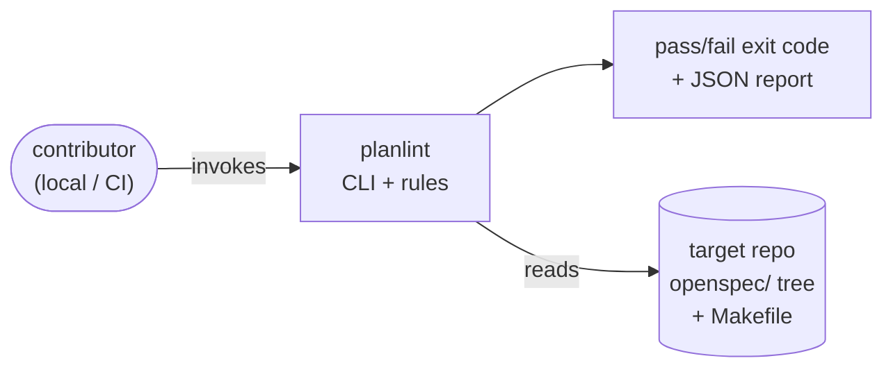
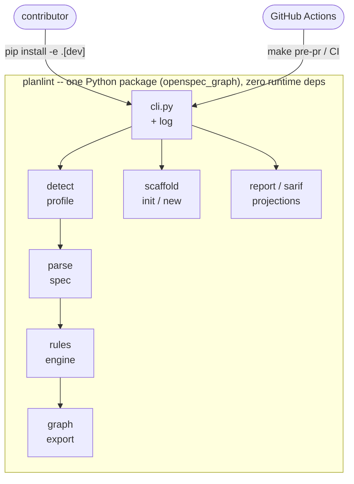
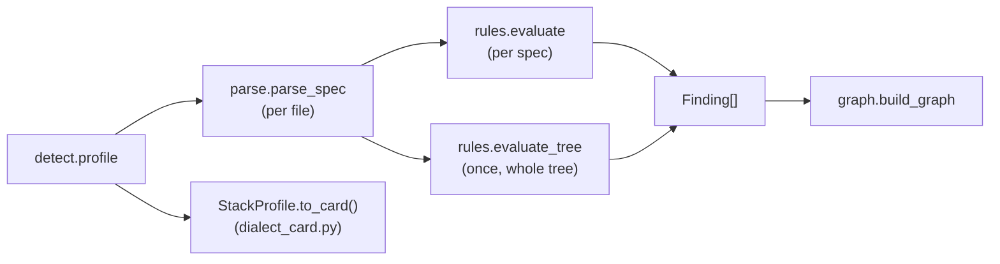
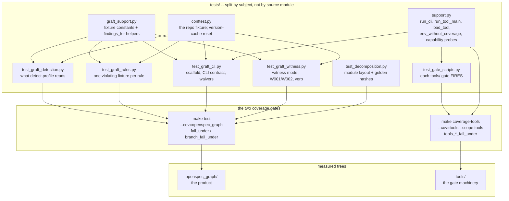

# C4 Architecture — planlint

A right-sized C4 model for `planlint`, a single-process Python CLI that grafts
an OpenSpec governance discipline onto a cloned repository and enforces it
mechanically. The goal is not autonomous agents — it is deterministic,
auditable rules that turn review prose into CI gates.

## 1. Context (System Context)

**`planlint`** applies a spec discipline to a cloned repository. It reads the
target's `openspec/` tree and detected conventions (Makefile targets, coverage
floor locator, spec dialect), evaluates a fixed rule engine, and emits a
pass/fail result plus a dependency graph. It is invoked locally by contributors
and in CI as a hard gate.

## 2. Container

One container: a dependency-free Python package (`openspec_graph`) plus a
`tools/` directory of CI gate scripts (coverage floors, secret scan, graph
diff, no-hardcoded-threshold check). Dev dependencies (pytest, ruff, mypy) are
optional extras, never required at runtime.

**Two trees, two coverage floors.** `openspec_graph/` and `tools/` are gated
separately — `make test` against `[tool.coverage.report] fail_under` and
`[tool.specgraph] branch_fail_under`, `make coverage-tools` against
`tools_line_fail_under` / `tools_branch_fail_under` via the same two checkers
under `--scope tools`. Separate because pytest-cov's `--cov-fail-under`
applies to the total of everything measured: a package at 99% has enough
headroom to absorb `tools/` falling to 60% without the combined figure moving
much, and the combined figure is what a single gate would enforce. The floors
are the same numbers (90/80) for both, because holding the gate machinery to a
lower bar than the code it guards is the argument this project exists to
refuse.

## 3. Component

| Component | Responsibility | Key types |
|---|---|---|
| `cli.py` | Argparse verbs, exit codes, logging setup | `main`, `cmd_*` |
| `sarif.py` | Pure SARIF 2.1.0 projection of serialized findings; dispatched by `cli.py` | `to_sarif` |
| `report.py` | Pure GitHub Action projections of a findings envelope (status, annotations, summary, outputs); SARIF stays in `sarif.py` via `cli.py` | `status_of`, `to_annotations`, `to_outputs`, `to_step_summary` |
| `detect.py` | Read the target repo's conventions | `StackProfile`, `profile`, `MAKEFILE_NAMES` (GNU Make's search order — the order is the contract) |
| `thresholds.py` | Coverage-floor discovery (pyproject / setup.cfg / .coveragerc / tox.ini / .ini), split out of `detect.py`; pure, no subprocess | `ThresholdSource`, `find_threshold`, `as_threshold_number` |
| `repo_io.py` | Shared tolerant read (`utf-8-sig`, directory-safe) and POSIX-relative path rendering, split out of `detect.py` | `read_text_or_none`, `to_posix_relative` |
| `machinery.py` | Structural Makefile parser, called by `detect.py`; never shells out to `make` | `MakefileFacts`, `parse_makefile` |
| `dialect_card.py` | CP-2 portable-snapshot schema + diff engine for `detect --format json`/`--diff` | `SCHEMA_VERSION`, `diff_cards` |
| `parse.py` | Facade over the parser submodules (below) | `ParsedSpec`, `Requirement`, `Criterion` |
| `rules.py` | Facade over the rule submodules (below); 29 deterministic rules + waiver handling | `Rule`, `Finding`, `evaluate`, `evaluate_tree` |
| `ledger.py` | Pure aggregation: `ParsedSpec.waivers` → a stable-ordered ledger (CP-4) | `LedgerEntry`, `build_ledger` |
| `witness.py` | Content-addressed CI witness store: atomic write, fail-closed load (CP-WM) | `Witness`, `write_witness`, `load_witnesses` |
| `mermaid.py` | Pure rendering: `build_graph()`'s dict → a Mermaid flowchart (CP-GV) | `to_mermaid` |
| `scaffold.py` | Write `openspec/` tree + change packages | `plan_init`, `plan_change` |
| `graph.py` | Pure projection of `validate` to a graph | `build_graph` |
| `log.py` | Stderr-only debug logging | `configure`, `level_from` |
| `tools/*` | CI gates (coverage, secrets, diff, thresholds) + generators (`render_mermaid.py`, `render_rule_catalog.py`, `render_plugin_manifests.py`) + the matcher-accuracy scorer (`matcher_accuracy.py`, a report whose gate is `tests/test_matcher_accuracy.py`). Two groups, and the distinction is load-bearing: the **seven gate scripts** are stdlib-only, run in a bare CI runner before anything is installed, and resolve every root at call time through a `None` sentinel rather than binding it into a signature default — which is what makes a gate testable against a fixture tree instead of only against its own checkout. The **four generators** (`matcher_accuracy`, `render_mermaid`, `render_plugin_manifests`, `render_rule_catalog`) import `openspec_graph` deliberately, to avoid a second copy of logic that would drift, and bind `repo_root()`-derived paths at import time. Neither group takes a third-party dependency | standalone scripts |
| `tests/*` | The gate the rest of this table is measured by. Split by subject, not by source module: `test_graft_*.py` (detection, rules, CLI, witness) are the behavioural core, `test_decomposition.py` pins the module layout and the golden `validate`/`graph`/`rules` hashes, `test_gate_scripts.py` proves each `tools/` gate *fires*, and `tests/corpus/` + `tests/fixtures/phrasing/` are the labelled corpora of §6 | `support.py`, `graft_support.py`, `conftest.py` |
| `skills/`, `.claude-plugin/`, `evals/` | Agent-facing distribution: the published Agent Skill, its plugin manifests, and the evaluation suite. Not imported by the package and not shipped in the wheel; validated by `tests/test_skill_contract.py` and `tests/test_agent_artifacts.py` | data + prose |
| `AGENTS.md`, `llms.txt`, `context7.json` | Root-level agent entry points: the pointer an agent loads unprompted, the machine-readable index, and the retrieval scope. Prose, not code; their links and claims are validated by `tests/test_agent_artifacts.py`, and the install commands in adopter-facing prose by `tests/test_adopter_urls.py` | data + prose |

**Data flow:**

`detect.profile` feeds `machinery.parse_makefile` for Makefile targets (falling
back to regex detection on low structural confidence), then every parsed spec
through `rules.evaluate` (per spec) and, once per run, `rules.evaluate_tree`
(whole-tree properties like "a declared invariant is cited by *some* spec"
that no per-spec check can express) — both feed the same `Finding[]`. The
graph is a pure projection of the same `detect` + `parse` +
`rules.evaluate`/`evaluate_tree` calls, so for an unscoped run `broken_links`
equals the finding count (AC-GR-4) — they cannot disagree by construction.
Under `--change` this is a deliberate, documented exception, not a bug:
`validate --change` skips the whole-tree `evaluate_tree()` checks (G006 and
G009) entirely, while `graph --change` always includes them, unscoped,
regardless of what's rendered (DEC-GV-002, generalized to G009 by
DEC-AD-004) — so the two can disagree on a `--change`-scoped run specifically
because of those checks. `StackProfile.to_card()` (`dialect_card.py`'s
schema, shown above as a separate branch off `detect.profile`) is a narrower
projection of the same result — a portable snapshot for `detect --format
json`/`--diff`, not part of the `validate`/`graph` finding pipeline.

## 4. Code (Module map)

Post-`decompose-god-files` (PR #4): the four largest modules were split into
focused submodules behind a stable facade, so external imports (`cli.py`,
tests, `__init__.py`'s public re-exports) are unaffected — only the internal
layout changed.

```mermaid
flowchart TD
    pkg["openspec_graph/"] --> init["__init__.py<br/>public API re-exports"]
    pkg --> cli["cli.py<br/>argparse verbs + logging; exit 0/1/2 contract"]
    pkg --> detect["detect.py<br/>StackProfile: languages, make_targets, dialect, invariants, adrs"]
    pkg --> thresholds["thresholds.py<br/>coverage-floor discovery; ThresholdSource, find_threshold"]
    pkg --> repo_io["repo_io.py<br/>read_text_or_none, to_posix_relative"]
    pkg --> machinery["machinery.py<br/>structural Makefile parser (CP-3); never shells out to make"]
    pkg --> dialect_card["dialect_card.py<br/>portable snapshot schema + diff engine (CP-2)"]
    pkg --> log["log.py<br/>configure(): stderr handler, level from -v / env var"]
    pkg --> graphmod["graph.py<br/>build_graph(): nodes/edges/broken_links, pure projection"]
    pkg --> mermaidmod["mermaid.py<br/>to_mermaid(): build_graph()'s dict -&gt; a Mermaid flowchart (CP-GV)"]
    pkg --> sarifmod["sarif.py<br/>to_sarif(): findings list -&gt; SARIF 2.1.0 (CP-6); dispatched by cli.py"]
    pkg --> reportmod["report.py<br/>status/annotations/summary/outputs from the findings envelope (CP-GA)"]
    pkg --> ledger["ledger.py<br/>build_ledger(): ParsedSpec.waivers -&gt; a stable-ordered ledger (CP-4)"]
    pkg --> witness["witness.py<br/>Witness dataclass, atomic write, load_witnesses() (CP-WM)"]
    pkg --> parse["parse.py<br/>facade: spec.md -&gt; ParsedSpec"]
    parse --> parse_model["parse_model.py<br/>Criterion / Requirement / ParsedSpec dataclasses"]
    parse --> parse_semantics["parse_semantics.py<br/>shared regex grammar; tiered non-success table, normative modal, hard-threshold, waiver detection"]
    parse --> parse_harness["parse_harness.py<br/>'harness' dialect parser (R-/C- + AC-AREA-n)"]
    parse --> parse_upstream["parse_upstream.py<br/>'upstream' dialect parser (### Requirement / #### Scenario)"]
    parse --> parse_speckit["parse_speckit.py<br/>'speckit' dialect parser (FR-/SC- bullets + User Story GWT prose)"]
    pkg --> rules["rules.py<br/>facade: RULES = GENERIC + HARNESS + UPSTREAM + SPECKIT + WITNESS"]
    rules --> rule_types["rule_types.py<br/>Finding / Rule dataclasses, ERROR/WARN/INFO"]
    rules --> rules_generic["rules_generic.py<br/>G001-G011 (dialect-agnostic)"]
    rules --> rules_harness["rules_harness.py<br/>H001-H006"]
    rules --> rules_upstream["rules_upstream.py<br/>U001-U005"]
    rules --> rules_speckit["rules_speckit.py<br/>S001-S005"]
    rules --> rules_witness["rules_witness.py<br/>W001-W002, evaluated only under --require-witness (CP-WM)"]
    pkg --> scaffold["scaffold.py<br/>facade: plan_init/plan_change -&gt; WritePlan -&gt; apply"]
    pkg --> scaffold_templates["scaffold_templates.py<br/>pure string templates for generated docs"]
```

`rules_generic.py` covers G001-G011, `rules_harness.py` covers H001-H006,
`rules_upstream.py` covers U001-U005, `rules_speckit.py` covers S001-S005,
and `rules_witness.py` covers W001-W002 — dialect-agnostic vs. per-dialect
vs. opt-in witness-mode rule families under the `rules.py` facade.

### Invariants (load-bearing, not aspirational)

- **`broken_links == len(validate findings)`, for an unscoped run** — the graph
  is a pure projection of `rules.evaluate`/`evaluate_tree`; the two cannot
  disagree by construction outside `--change`. Under `--change` they
  deliberately can: `graph --change` always includes G006/G009's tree-wide
  findings unscoped, while `validate --change` skips both entirely
  (DEC-GV-002, generalized to G009 by DEC-AD-004) — a documented exception
  to this invariant, not a violation of it.
- **Logging never reaches stdout** — `log.py` attaches a stderr handler and
  disables propagation, so `--json` output stays parseable.
- **No hard-coded thresholds** — coverage floors live in `pyproject.toml`,
  `.coveragerc`, or `setup.cfg`; the Makefile and workflow only invoke
  scripts that read them (rule G003).
- **`machinery.py` never shells out to `make`** — structural Makefile
  parsing is text-only (`str`/`re` operations), at any confidence level,
  with no fallback that shells out either. GNU Make evaluates `$(shell ...)`
  calls at parse time unconditionally, so no flag combination makes
  invoking a real `make` safe against an untrusted target repo's Makefile.
  Enforced by a static import guard (`test_machinery_never_imports_subprocess`)
  and a runtime execution test, not just convention.
- **Structural Makefile parsing is linear in input size, even on
  malformed input** — never shelling out is necessary but not sufficient
  for "safe against an untrusted Makefile": an earlier version of
  `define`/`endef` handling used a whole-text regex with unbounded lazy
  matching that was quadratic-time on an unterminated block (32+ seconds
  on a 20K-line adversarial input), found by an independent review before
  merge. `machinery.strip_define_blocks` (shared by `machinery.py` and
  `detect.py`'s legacy fallback, so the two can't independently diverge
  on this handling again) is a single O(n) line-scan instead. Proven by a
  bounded-wall-clock-time test, not asserted from complexity analysis alone.
- **Dialect cards never carry an absolute path** — `StackProfile.to_card()`
  excludes `root` and reduces `openspec_root` to a portable
  `has_openspec_root` boolean, so `detect --format json`/`--diff` (CP-2)
  is byte-identical for the same logical repo checked out at two different
  paths. Proven by a cross-checkout-path test, not just code review.

---

## 4b. Test and gate topology

The package's module map (§4) says nothing about what proves it. This is that
view: which tree each gate measures, and which gate would catch a given
regression.

**Why the two gates are separate runs.** pytest-cov's `--cov-fail-under`
applies to the combined total of everything measured, so one run measuring
both trees would produce one diluted number — and that number is what the
gate would enforce. Two runs, two scopes, two floors; `--scope` sums the
per-file entries under one subtree instead of reading the report's `totals`.

A scope that matches nothing yields 0 measured statements, and **0/0 is not
100%** — it is a gate pointed at nothing. Both checkers exit 2 on it, which is
the same rule they already applied to a missing floor: a misconfiguration is
never a silent pass.

**Why in-process, not subprocess.** A subprocess's execution is invisible to
coverage, so four gate scripts read 0% while being thoroughly tested. Handing
the child the config would not have fixed it either: the coverage gates read
`Path("pyproject.toml")` from the cwd, so their tests run them from a throwaway
directory, and coverage resolves a relative `source` entry against that same
cwd. `support.run_tool_main` calls `main(argv)` in-process instead. What that
cannot see — whether the file still *runs* as a script, which is how the
Makefile and every workflow invoke all eleven — is covered once for the whole
directory by `test_gate_script_is_runnable_as_a_script`.

**Why `tests/` is flat.** `test_spec_test_citations.py` and
`test_decomposition.py` both glob `tests/test_*.py` non-recursively. A
`tests/graft/` package would have silently orphaned 187 tests from two gates —
the "one rename away" defect class this repo keeps finding in other people's
repositories, and the cheap fix is to not create the rename.

---

## 5. Generated artifacts

Three files in the tree are **generated, never hand-edited**: the distributable
skill's rule catalog
(`skills/planlint-spec-governance/references/rule-catalog.md`) and the two
`.claude-plugin/` manifests. Each has exactly one writer under `tools/`,
`make skill-artifacts` regenerates all three, and each has a `--check` mode a
test runs so a stale copy fails `make test` rather than shipping. The shared
`write_or_check` helper in `tools/_common.py` guarantees the write and check
modes compare the same bytes; two independently formatted modes would make the
check theater.

`tools/render_mermaid.py` is a fourth generator but not a fourth generated
file: it is a stdout filter over a previously saved `graph --format json`, it
writes nothing tracked, and so it has no `--check` mode. It is pinned instead by
byte-comparison against `mermaid.to_mermaid`
(`test_render_mermaid_matches_to_mermaid_byte_for_byte`), which is the same
guarantee by a different route.

## 6. Labelled corpora and measured matchers

Two parts of the system read untrusted input that no fixture set can
enumerate: `detect.py` reads a stranger's repository, and two rules
(G002, U004/S003) read English prose. Both are held to labelled corpora
rather than to the one-fixture-per-rule map alone.

| Corpus | Feeds | Compared by | Gate |
|---|---|---|---|
| `tests/corpus/targets/` — labelled synthetic target repositories, each with the partial dialect card a correct detector should emit | `detect.profile().to_card()` | `dialect_card.diff_cards()`, which ignores fields absent from the baseline so each shape asserts only its own dimension | `tests/test_detect_corpus.py` in `make test` |
| `tests/fixtures/phrasing/` — hand-labelled criterion and requirement sentences | `Criterion.is_negative`, `Requirement.is_normative` | `tools/matcher_accuracy.py`, which scores the real matcher and reports per-pattern true/false positives | `tests/test_matcher_accuracy.py` in `make test`, floors from `pyproject.toml` `[tool.specgraph]` |

The non-success matcher itself is a tiered table
(`parse_semantics.NEGATION_PATTERNS`): *annotation* patterns see only the
criterion's own marker, *structural* patterns are absence grammar with zero
measured false positives, and *lexical* patterns are verbal inflections that
refuse a following hyphen. The tier is the design — a flat list of bare words
scored precision 0.38 and silenced G002 on ordinary prose — and
`Criterion.negation_evidence` reports which patterns fired so a finding can be
argued with.

`tests/test_properties.py` sits alongside these: five Hypothesis properties
over the parsers, derandomised so the gate cannot flake. The corpora say what
the parsers do on known input; the properties say what they never do on any.
