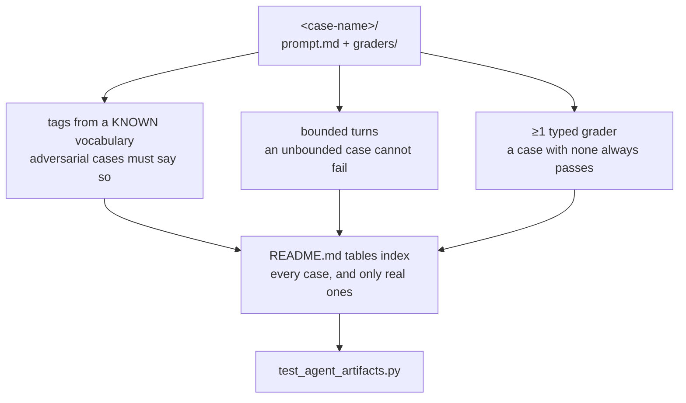

# Working in `evals/`

The skill's own gate. Each case is a directory holding a `prompt.md` and typed
`graders/` — a behavioural test of how an agent uses planlint, where the rest
of the suite tests the code.

- **A case with no typed grader always passes**, which is worse than no case:
  it reports a green eval for behaviour nothing checked.
- **Turns must be bounded.** An unbounded case cannot fail; it can only run
  out of patience.
- **Tags come from a fixed vocabulary**, and the adversarial table and the
  `adversarial` tag have to agree — `test_adversarial_table_and_the_adversarial_tag_agree`
  fails when they drift.
- **No credential-shaped literal in a prompt.** These files are published, and
  `test_eval_prompts_quote_no_credential_shaped_literals` refuses one even
  when it is obviously fake.
- **`README.md`'s tables must index every case and only real ones.** A renamed
  directory leaves a row pointing nowhere.

The runner writes its own output beside the cases (`results/<timestamp>/`,
`mocks/`), so a case is identified by carrying a prompt rather than by not
being on a blacklist.

Use the `planlint-add-eval-case` skill — it names every file that must move
together when a case is added, renamed or removed.

Precedence: where this disagrees with the operating contract in
[`SKILL.md`](../skills/planlint-spec-governance/SKILL.md), `SKILL.md` wins;
then [`../AGENTS.md`](../AGENTS.md); then this file. Nothing here is the only
place a rule is written.
