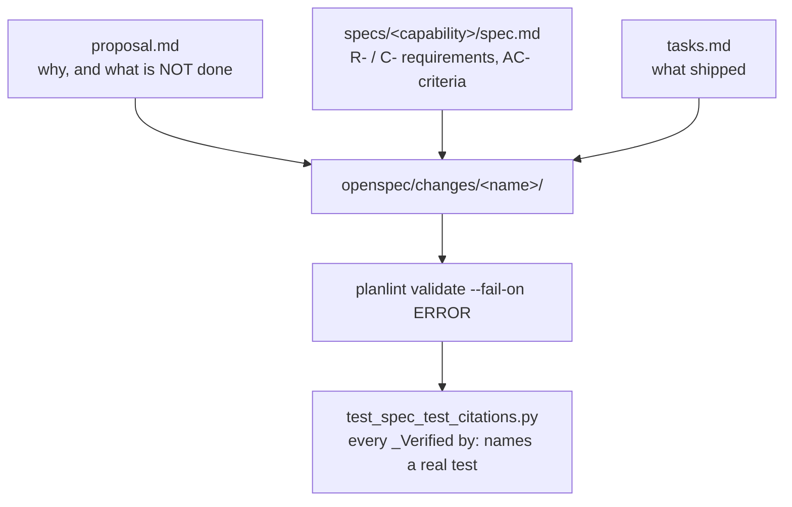

# Working in `openspec/`

Change packages — the specs planlint lints **itself** with. Editing anything
here changes the tool's own self-scan, so run the gate first and report what it
said:

```
planlint --target . validate --fail-on ERROR
```

Exit 0 is clean, 1 is findings, 2 is could-not-run. A nonzero exit is
authoritative: never report a pass this tool did not report.



Three ways a package fails that are not obvious from reading a good one:

- **The id shape is exact:** `(?:R|C)-[A-Z]{2,}-\d+` with a word boundary. A
  letter suffix like `R-SER-3a` kills the boundary and H002 rejects it — use
  the next free number instead.
- **A backticked `` `make <stage>` `` in prose is read as a real citation.**
  The matcher cannot tell prose from a claim, so G004 fires if the target does
  not exist. Rephrase; do not waive.
- **Every `_Verified by:` selector must name a real test function.**
  `test_spec_test_citations.py` resolves each one by AST, so a renamed test
  breaks the spec that cites it.

The `spec.md` — not just the `proposal.md` — has to match what shipped. This
repository has already merged one proposal describing behaviour the code did
not have; drafting against the diff is the habit that prevents it.

Draft with the `spec-drafter` subagent, then review with `spec-adversary`
before implementation starts. Neither replaces running the gate yourself.

Precedence: where this disagrees with the operating contract in
[`SKILL.md`](../skills/planlint-spec-governance/SKILL.md), `SKILL.md` wins;
then [`../AGENTS.md`](../AGENTS.md); then this file. Nothing here is the only
place a rule is written.
