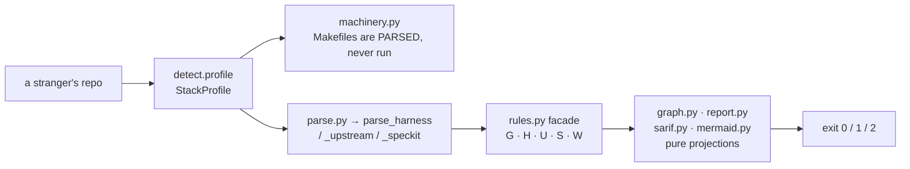

# Working in `openspec_graph/`

The product: a spec tree in, a verdict out. Everything here is pure except the
filesystem reads in `detect.py` and `parse.py` — the scan executes **nothing**
from the repository it is pointed at, which is the one security guarantee this
tool makes ([`../SECURITY.md`](../SECURITY.md)).

Four things that are load-bearing rather than stylistic:

- **Zero runtime dependencies.** `[project] dependencies` is empty and
  `test_new_modules_stdlib_only` guards it. The supply chain for a scan is the
  standard library; adding an import breaks that promise, not just a test.
- **`machinery.py` never shells out to `make`.** GNU Make evaluates
  `$(shell …)` outside a recipe at parse time, unconditionally, so no flag
  makes running a stranger's Makefile safe. Parsing is text-structural at
  every confidence level, with no fallback that executes. Enforced by a static
  import guard and a canary-directory test.
- **One `Rule`, one severity.** `Rule` is a frozen dataclass with a single
  `severity` field, so "warn here, error there" means two rules and two ids.
- **The graph is a projection of the same evaluation**, so `broken_links`
  equals the finding count for an unscoped run. `--change` is a documented
  exception, not a licence to let them drift.

Adding, renaming or removing a rule touches more places than is guessable —
baseline JSON, the generated skill catalog, the README table, `c4.md`'s count
*and* per-family ranges, and `rules.py`'s docstring. Use the
`planlint-add-rule` skill and let `tests/test_rule_registry_docs.py` tell you
what is stale rather than guessing.

Verify with `make pre-pr`, or the `planlint-verifier` subagent.

Precedence: where this disagrees with the operating contract in
[`SKILL.md`](../skills/planlint-spec-governance/SKILL.md), `SKILL.md` wins;
then [`../AGENTS.md`](../AGENTS.md); then this file. Nothing here is the only
place a rule is written.
