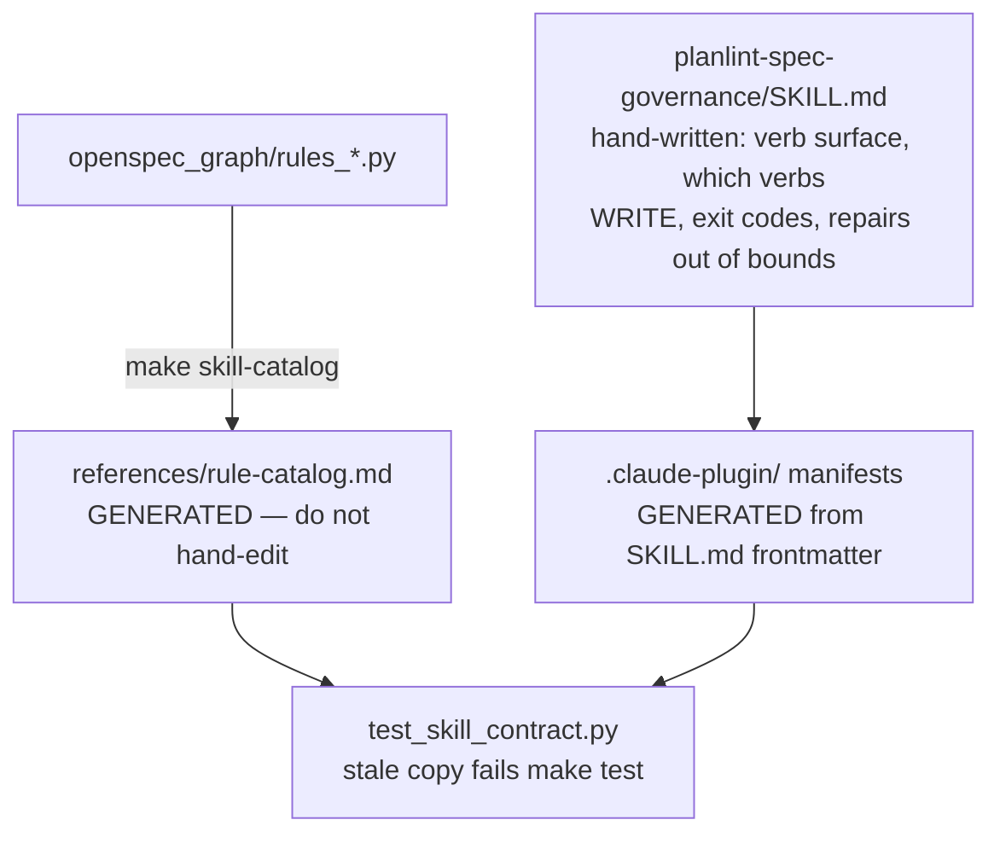

# Working in `skills/`

The published product surface. `planlint-spec-governance/SKILL.md` is the
operating contract an agent reads **before** invoking the CLI, and it outranks
every `AGENTS.md` in this repository including this one.

- **`planlint-spec-governance/references/rule-catalog.md` is generated.** It
  has exactly one writer,
  `tools/render_rule_catalog.py`, and a `--check` mode a test runs. Hand-edit
  it and the next `make skill-artifacts` silently reverts you.
- **The plugin manifests are generated too**, from this skill's frontmatter
  `description`. It must be a non-empty single-line scalar — a folded `>-`
  would otherwise ship as the published description, which
  `test_plugin_manifests_reject_an_unusable_description` now refuses.
- **This is read by machines outside this repository**: a plugin installer, a
  retrieval index, an eval runner. Nothing else here would notice a malformed
  manifest, so `test_skill_contract.py` and `test_agent_artifacts.py` are the
  only feedback before someone else's tool breaks.

Rule changes reach this directory through the `planlint-add-rule` skill; the
catalog regeneration is step 3 of it, not an afterthought.

Precedence: where this disagrees with the operating contract in
[`planlint-spec-governance/SKILL.md`](planlint-spec-governance/SKILL.md),
`SKILL.md` wins; then [`../AGENTS.md`](../AGENTS.md); then this file. Nothing
here is the only place a rule is written.
