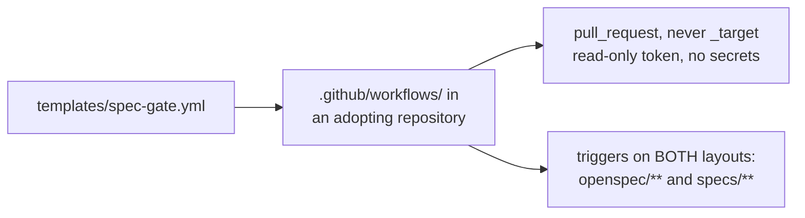

# Working in `templates/`

Files copied **into someone else's repository**. `spec-gate.yml` is the
workflow an adopter drops into `.github/workflows/`, so every line is a
default handed to a stranger rather than a choice this repo makes for itself.

- **`pull_request`, never `pull_request_target`.** This workflow checks out and
  scans the contents of a pull request, which on a fork is untrusted. The
  `_target` variant would hand that same checkout write permissions and the
  repository's secrets.
- **Both spec-tree layouts trigger it.** Listing only `openspec/**` meant a
  SpecKit repository silently never ran the gate it had just installed — an
  adopter-facing fail-open, and the reason `specs/**` is there.
- **A default here is harder to change than one in this repo**, because it has
  been copied. Prefer the conservative option and say why in a comment the
  adopter will read.

Changing scaffold output means re-pinning the tests that assert it; `planlint
init`'s generated tree is compared byte-for-byte, so a wording change is a
test change.

Precedence: where this disagrees with the operating contract in
[`SKILL.md`](../skills/planlint-spec-governance/SKILL.md), `SKILL.md` wins;
then [`../AGENTS.md`](../AGENTS.md); then this file. Nothing here is the only
place a rule is written.
