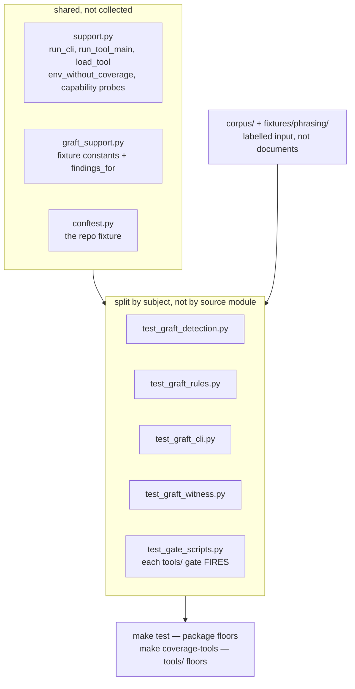

# Working in `tests/`

The negative cases are the point. A linter that never fails is a decoration, so
every rule has a fixture that violates it and an assertion it fires on exactly
that violation. A test added here should fail before the change it covers —
check that, don't assume it.

Three things to know before adding a file here:

- **Do not create `tests/<subdir>/`.** `test_spec_test_citations.py` and
  `test_decomposition.py` both glob `test_*.py` **non-recursively**. A
  subdirectory silently orphans its tests from both gates — this is why the
  2321-line `test_graft.py` was split into flat siblings rather than a package.
- **Never redeclare `write_spec` inline.** Import it from
  [`support.py`](support.py); `test_helpers_not_duplicated_inline` enforces
  this, because a local copy drifts from the shared one's fixes.
- **A spec's `_Verified by:` citation must name a real test function.**
  `test_spec_test_citations.py` resolves every one by AST; renaming a test
  breaks the spec that cites it.

`corpus/` and `fixtures/` are labelled input to planlint, not documents of this
repository — the agent-artifact gates exclude them by prefix for that reason.

Run `make test` for the package floors and `make coverage-tools` for `tools/`;
they are separate runs because one combined number would dilute both. The
`planlint-verifier` subagent runs the whole ladder.

Precedence: where this disagrees with the operating contract in
[`SKILL.md`](../skills/planlint-spec-governance/SKILL.md), `SKILL.md` wins;
then [`../AGENTS.md`](../AGENTS.md); then this file. Nothing here is the only
place a rule is written.
