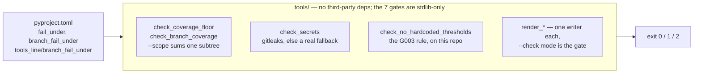

# Working in `tools/`

Gate scripts. `make pre-pr` and every CI job run these, so a gate whose failing
path is untested is worse than no gate: it reports PASS on the thing it was
added to catch. Three of these did exactly that until
[`../tests/test_gate_scripts.py`](../tests/test_gate_scripts.py) was written.

Three things this directory gets wrong if you are not watching:

- **Never bind a root into a signature default.** `def f(root=REPO_ROOT)` is
  evaluated at definition time, so reassigning the module constant changes
  nothing and the script can only ever run against its own checkout. Use
  `root: Path | None = None` and resolve inside. This is why three gates had
  no tests: they were untestable, not neglected.
- **Never hard-code a threshold.** It belongs in `pyproject.toml`;
  [`check_no_hardcoded_thresholds.py`](check_no_hardcoded_thresholds.py)
  fails the build over it, and a governance tool that pins its own numbers
  argues against its own rule.
- **No third-party dependencies, ever.** Shared helpers go in
  [`_common.py`](_common.py). The seven gate scripts are additionally
  **stdlib-only** and run in a bare CI runner before anything is installed;
  the four generators (`matcher_accuracy`, `render_mermaid`,
  `render_plugin_manifests`, `render_rule_catalog`) import `openspec_graph`
  deliberately, to avoid a second copy of logic that would drift, and so need
  the package installed.

Three argv conventions, and the split is not "argparse or not" — group by
what `main` expects. Program name first: the seven hand-rolled scripts, plus
`matcher_accuracy`, which strips it itself. Arguments only:
`render_plugin_manifests`, `render_rule_catalog`, and `check_wheel_metadata`
(whose `main` defaults `argv` to `None`). `run_tool_main`'s `pass_argv0` picks.

Test behaviour in-process against `main(argv)` — a subprocess is invisible to
coverage. The `python tools/<script>.py` path is covered once for the whole
directory by `test_gate_script_is_runnable_as_a_script`; adding a script means
adding one line to its parametrize list.

Verify with `make pre-pr`, or the `planlint-verifier` subagent, which runs the
whole ladder and reports per-gate remediation.

Precedence: where this disagrees with the operating contract in
[`SKILL.md`](../skills/planlint-spec-governance/SKILL.md), `SKILL.md` wins;
then [`../AGENTS.md`](../AGENTS.md); then this file. Nothing here is the only
place a rule is written.
